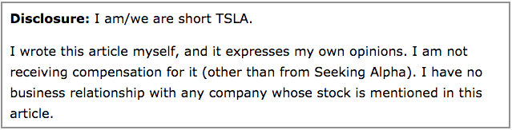
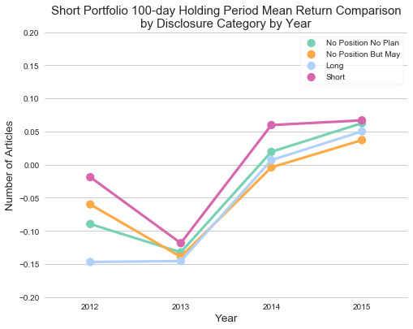
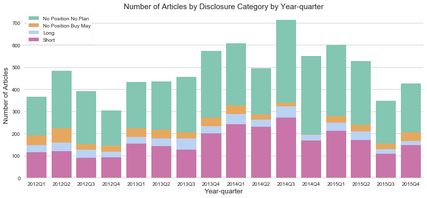

# Do Short Recommendations of  Predict Future Stock Returns?

## I. Background and Motivation

Short selling is the exact opposite of buying stock. Consequently, short sellers make money when the stock price goes down. There is now overwhelming evidence that short sellers are informed traders. ([Asquith et al. (2005)](http://finpko.faculty.ku.edu/myssi/FIN938/Asquith%20Pathak%20%26%20Ritter.short%20sales%20%26%20instos.JFE_2005.pdf), [Boehmer et al. (2008)](https://pdfs.semanticscholar.org/277a/1462fe69a68bd7ec0192b67cf42893639089.pdf), [Diether et al. (2009)](https://fisher.osu.edu/sites/default/files/short_sale_strategies_and_return_predictability_575.pdf), [Engelberg et al. (2012)](http://rady.ucsd.edu/faculty/directory/engelberg/pub/portfolios/SHORT_NEWS.pdf), [Rapach et al. (2016)](http://www.stagirit.org/sites/default/files/articles/a_0351_ssrn-id2474930.pdf)) To put it differently, short sellers have skills to pick the right stock at the right time.

Nowadays, social media has become a popular venue for individuals to share the results of their own analysis on financial securities ([ref](http://www.bhwang.com/pdf/5_wisdom-of-crowds.pdf)). For example, [Seeking Alpha](https://seekingalpha.com) ("SA", hereafter), the biggest investment-related social-media website in the US, has more than 10 million users as of 2018 according to SA. Articles submitted to SA are generally reviewed by a panel and are subject to editorial changes. The review process is intended to improve the quality of published articles without interfering with the author’s original opinion. It is known that the authors of SA are consisted of individual and institutional investors, fund managers, retirees and analysts.

As a user of SA myself, I have always wondered if the authors who write articles in short ideas section, where people discuss and recommend stocks for short sell, are the "informed traders" who consistently predict future returns. If so, the price of stocks they recommend in their articles should go down in the near future. In this project, I try to investigate questions about the return predictability of SA short recommendations from various perspectives as follows.

*	**Q1: *Do overall short recommendations of SA predict future stock returns?***
*	**Q2: *Do short recommendations of SA top opinion leaders predict future stock returns?***
*	**Q3: *Do short recommendations of SA Editors’ Pick Articles predict future stock returns?***
*	**Q4: *Do short recommendations of SA made by the authors who have sold short the stocks predict future stock returns?***
*	**Q5: *Are there any authors of SA who consistently predict future stock returns?***

## II. Workflow and Technology Stack
Following is the schematic of the technology stack used in this project.  

Seeking Alpha short ideas data was collected by web scraping, using [Scrapy](https://scrapy.org/). The scraper ran on an [Amazon Web Services](https://aws.amazon.com/) (AWS) EC2 instance, and the results were stored in CSV format in an S3 bucket. There was significant web scraping issue because there is a strict limitation on the amount of data that can be scraped at once from SA. This was resolved by using Amazon EC2 and tweaking user-agent setting on Scrapy. Stock return and price data were obtained from CRSP and Yahoo Finance respectively. Data analysis was performed using [pandas](https://pandas.pydata.org/) and [NumPy](http://www.numpy.org/). I used [matplotlib](https://matplotlib.org/) and [seaborn](https://seaborn.pydata.org/) to produce visualizations.

## III. Data Preparation
Data is collected from four different sources, Seeking Alpha, Wayback Machine, CRSP and Yahoo Finance. More detail about the data preparation including the codes can be found [**here**](notebooks/Data_Preparation.ipynb).

### 1. Short ideas articles from Seeking Alpha

First, I scrapped the information about the articles published between 2012 and 2015 in [short idea section](https://seekingalpha.com/stock-ideas/short-ideas) of SA. It includes the title, ticker of stock recommended, date and time of the articles, editors’ pick and disclosure information as well as the author of the article. Scrapy codes for the web scraping can be found [**here**](src/Scrapy/).

### 2. SA opinion leaders data from Wayback Machine
SA provides the list of the most read authors, called opinion leaders, in the last 90 days by topic including short ideas as of today. Since the opinion leaders vary over time, in order to investigate Q2, it is necessary to scrape the time-series of short ideas opinion leaders of SA. I was able to get the list of the short ideas opinion leaders for every quarter in the sample period from [Wayback Machine](https://archive.org/web/), a digital archive of the World Wide Web and other information on the Internet.

### 3. Daily stock data from CRSP and Yahoo Finance
Stock related data such as daily adjusted return, price and sic codes are obtained from CRSP through [wrds](https://wrds-web.wharton.upenn.edu) and [Yahoo! Finance](https://finance.yahoo.com/) using an open API.

## IV. Data Analysis
The time period of the dataset, based on the article publication date, is from 1/1/2012 to 12/31/2015. It contains 7,873 single-ticker articles that discuss 1,637 different stocks, written by 1,622 authors. Here’s the list of the feature variables.

* Article ID
* Publication date and time
* Author name and ID
* Ticker of stock recommended
* Editors’ Pick
* Disclosure of author’s position
* Industry classification of the stock (SIC code)
* Holding period returns (5-day ~ 100-day)

More detail about the data analysis including the codes can be found [**here**](notebooks/Data_Analysis.ipynb).

### **Q1: *Do overall short recommendations of SA predict future stock returns?***
If we short all the stocks recommended in short ideas section of SA, could we generate positive return (make money) on average? Let’s take a look at the performance of the short portfolio constructed using all the stocks recommended, in different holding periods from 5 to 100 trading days. The box plots below show the distribution of the holding period returns of each stock included in the short portfolio. The diamond-shaped marker inside the box indicates the average of the returns. How to read a box plot can be found [here](images/box-and-whisker-plot-diagram.png).

 

* The number of short ideas article publications varies over time from 1600 to 2400 per year during the sample time period.
* Overall short recommendations of SA do not predict future returns on average. In other words, if we short all the stocks recommended in short ideas section of SA during the overall time period of our sample, we lose money on average.
* However, the performance of the short portfolio varies significantly over time. For example, 100-day holding period mean return in 2013 and 2015 is approximately -14% and +7%, respectively.

### **Q2: *Do short recommendations of SA top opinion leaders predict future stock returns?***
In question 1, it was shown that the overall short recommendations of SA do not predict future returns on average.  In this section, I will narrow down the scope of the authors and investigate whether the short recommendations of the “popular” authors predict future returns. Seeking Alpha provides the list of the most read authors in the last 90 days, called opinion leaders, by topic. (For example, long ideas, short ideas etc.) Usually, they not only publish articles actively but also have many followers. Let's compare the performance of the short portfolio constructed using stocks recommended by the top 5 opinion leaders and the others.

#### Overall time period

 

* During 2012~2015, around 15.7% of the articles were published by the top 5 opinion leaders.
* Contrary to expectations, short recommendations of top 5 opinion leaders do not predict future returns on average. In other words, if we short all the stocks recommended by the top 5 opinion leaders during the overall time period of our sample, we lose money on average.
* What is more surprising is that we lose even more by following the top 5 opinion leaders’ recommendations than all the other authors’ recommendations.

#### By year

 

* Return predictability of the short portfolio varies from year to year.
* Interestingly, the short portfolio constructed using stocks recommended by top 5 opinion leaders generates negative returns in all years, even in the years when the short portfolio constructed using stocks recommended by all other authors generates positive returns.

### **Q3: *Do short recommendations of SA Editors’ Pick Articles predict future stock returns?***
Up until now, we saw that both overall short recommendations and the ones from popular authors do not predict future returns on average. This section tries to find the information that can distinguish the recommendations that predict the future return from the others. If you take a look at the articles of SA closely, you will find some of them are marked as “Editors’ Pick”. According to SA, "Editors’ Picks represent what our editorial staff believes to be the most convincing and actionable analysis of the day." Then, wouldn’t it be possible that the short recommendations of the articles picked by the experienced investors (editors) as superior analyses predict future returns? Let's investigate the performance of the stocks recommended in those articles and see if the editors distinguish the good analyses from others.

#### Overall time period

 

* During 2012~2015, around 11.3% of the articles were selected as “Editors’ Pick”.
* Contrary to expectations, short recommendations of Editors’ Pick articles do not predict future returns on average. In other words, if we short all the stocks recommended in the Editors’ Pick articles during the overall time period of our sample, we lose money on average.
* What is more surprising is that we lose even more by following the recommendations of Editors’ Pick articles than that of all the other articles.

#### By year

 

* Performance of the short portfolios varies from year to year.

### **Q4: *Do short recommendations of SA made by the authors who have sold short the stocks predict future stock returns?***

In order to maintain the reliability of the articles, authors of Seeking Alpha are required to disclose personal positions in stocks they write about. Here is an example of the disclosure information from one of the short ideas articles.

Through EDA, I was able to figure out that there are 4 different disclosure categories as follows.

* **Short**: Author is short the stock mentioned.
* **Long**: Author is long the competitor of the stock mentioned.
* **No Position But May**: Author has no positions in any stocks mentioned, but may initiate positions within the next 72 hours.
* **No Position No Plan**: Author has no position in any stocks mentioned, and no plans to initiate any positions within the next 72 hours.

If the authors recommend shorting the stock they have sold short, the readers naturally consider it as a sign of confidence on their prediction and think their analysis is trustworthy. But are there any grounds for this belief? Let’s find out whether their short recommendations predict future returns and better than the others’.

#### Overall time period

 

* During 2012~2015, authors recommend stocks they have sold short (named “Short” disclosure category) approximately in one third of all articles.
* Ignoring the shorting fee, those articles do predict future returns on average. In other words, if we short all the stocks that authors have sold short during the overall time period of our sample, we generate positive return on average.
* However, if we short all the other stocks that authors have not sold short (“Long”, “No Position But May” and “No Position No Plan”), we generate negative returns on average.

It is interesting that disclosure information of author’s short position is actually related to the future return predictability but is it consistent over time? Let’s compare the performance of short portfolios of different disclosure category each year. Box plot of short portfolio returns can be found [**here**](images/Q4_04_Ret_disclosure_by_yr.png).

#### By year

 

* Return predictability varies over time. In some years, the short portfolio of “Short” disclosure category generates positive returns but sometimes not.
* Interesting thing is that the short portfolio of “Short” disclosure category consistently outperforms all the other categories every year.

Let’s take a look at quarterly data. Box plot of the short portfolio returns can be found [**here**](images/Q4_06_Ret_disclosure_by_yrqt.png).

#### By year-quarter

 

* In quarterly data, “Short” disclosure category (red line) outperforms all the other categories in 10 out of 16 year-quarters and performs the second best in 3 out of 16 year-quarters.

### **Q5: *Are there any authors of SA short ideas articles who consistently predict future stock returns?***

In this section, I will track the authors' individual performance and check if there's anyone who consistently predict future returns and deserve to be called "informed trader". Picking the right stock at a right time once or twice really isn't that hard. What determines the informed trader is the ability to "consistently" pick the right one at the right time on average. I assume that the authors who satisfy the following conditions as informed short seller.

* **Consistency**: *Published articles in short ideas section of SA more than 30 times during the sample period.*
* **Profitability I**: *The stocks they recommend generate positive average returns by short-selling for all different time periods (5-day ~ 100-day return).*
* **Profitability II**: *Longer the holding period, larger the average returns by shorting.*

By screening the performance of individual authors, I was able to find some authors who satisfy the conditions of informed trader above. (Please note that the conditions are pretty strict, so there would be more “informed short seller” among the authors on SA if we make the assumption less strict.) Let’s take a look at two of them and see how well they did and what kinds of stocks they recommended. More results can be found here.

 

* The stocks they recommended shorting generate a significant return. (10 ~ 30% in 100-days)
* They are hedge fund managers, analyst or private investors.
* Some of them focus only on their specialized sector but the others hold diversified short portfolio.

## V. Conclusion and Future Work

Contrary to expectations, overall short recommendations of SA (from 2012 to 2015) didn’t predict future returns on average. More surprisingly, the short recommendations of both top opinion leaders and SA editors performed even worse than the ones of the other authors. However, **in the case that the authors recommend shorting the stock they have sold short, the short recommendations predicted the future returns on average** and **consistently outperform the short portfolio constructed using the stocks the authors haven't sold short over time**. During the sample time period, there exist some authors who generate significant returns by shorting the right stock at the right time on average. How they obtain the information advantage will be saved as a future work.
